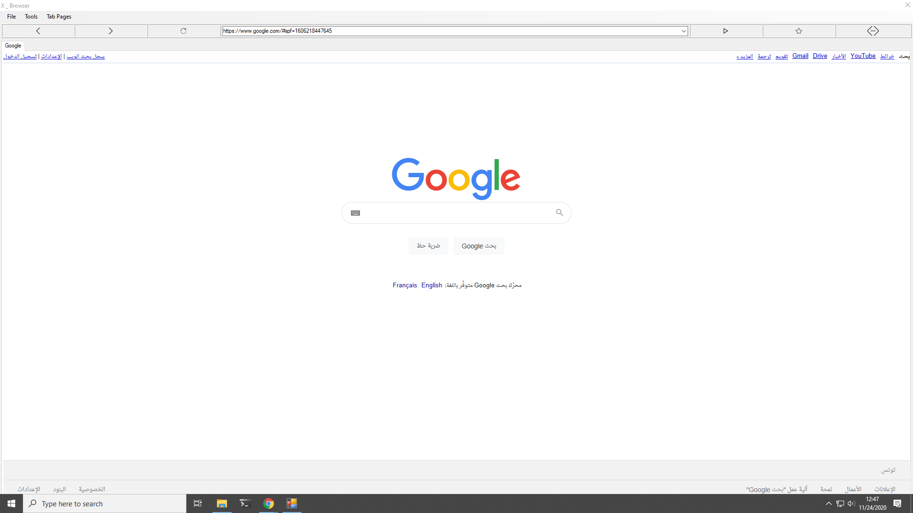
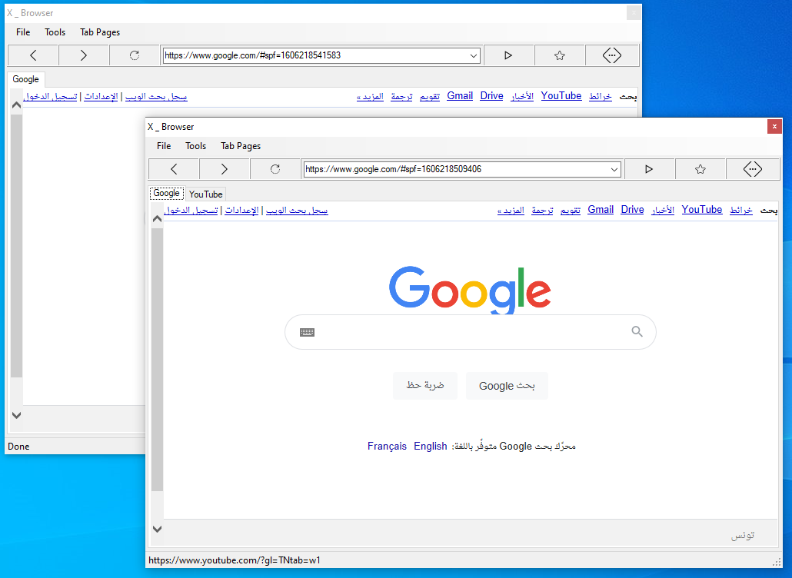

# MultiTab-Web-Browzer-Vb-net

Create web browser with tabs in vb.net using web browser, tab control.

vb.net - How to Add Tabs to a Web Browser
vb.net - create a Web Browser + Tab + History
tabbed webbrowser in visual vb.net
vb.net Tabbed Web Browser
How to manage tabs in vb.net on tab control

 

 

